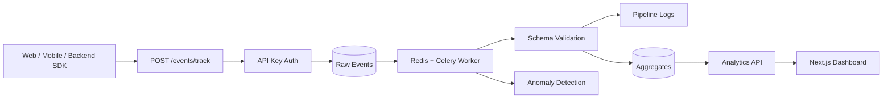
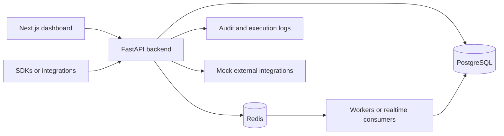
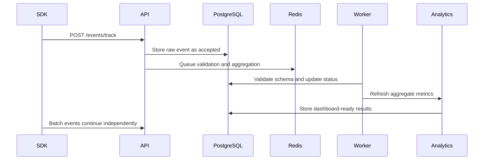

# Event Analytics Pipeline

[](https://github.com/SpyloDEV/event-analytics-pipeline/actions/workflows/ci.yml)


A lead-level event analytics and data pipeline platform for product and engineering teams. It models the core of an internal Segment/Mixpanel-style system: event ingestion, API keys, schema validation, raw event storage, async pipeline jobs, aggregates, funnels, anomaly detection, pipeline logs, audit trails, and dashboards.

This is built like a real internal platform, not a tutorial. The backend uses FastAPI, SQLAlchemy 2.0, Alembic, PostgreSQL, Redis, Celery, service/repository layers, hashed API keys, and tests. The frontend is a polished Next.js dashboard for operators and analysts.

## Architecture



## Features

- JWT auth with register, login, and current user endpoint
- Organizations, projects, project members, and roles: owner, admin, developer, analyst, viewer
- Hashed API keys scoped to projects with revoke and last-used tracking
- API-key protected event ingestion through `/events/track` and `/events/batch`
- Raw event storage with properties, context, timestamp, ingestion status, and validation errors
- Event schema registry with required properties and property type validation
- Pipeline logs for received, validation started, validation passed/failed, aggregation updated, and anomaly detected events
- Aggregation APIs for overview, top events, users, countries, sources, and event trends
- Funnel definitions and conversion result calculation
- Mock anomaly detection for volume spikes, drops, validation error rate, and missing expected events
- Audit logs for project, API key, schema, rejected event, and anomaly actions
- Next.js dashboard with event tables, schemas, funnels, anomalies, pipeline health, analytics, API keys, and audit logs
- Docker Compose and GitHub Actions CI

## Event Ingestion Flow

1. Client sends an event with `X-API-Key`.
2. API key is hashed and matched against active project credentials.
3. Raw event is stored with `accepted` status.
4. Pipeline logs `event received`.
5. Validation loads the event schema if one exists.
6. Missing required fields or invalid property types mark the event as `failed`.
7. Valid events are marked `processed`.
8. Analytics and anomaly views read from stored raw events and pipeline data.

## API Example

```bash
curl -X POST http://localhost:8000/api/v1/events/track \
  -H "Content-Type: application/json" \
  -H "X-API-Key: sk_live_demo_event_pipeline_key" \
  -d '{
    "event_name": "document_uploaded",
    "user_id": "user_123",
    "anonymous_id": "anon_456",
    "timestamp": "2026-05-02T12:00:00Z",
    "properties": {
      "file_type": "pdf",
      "file_size_mb": 2.4,
      "source": "dashboard"
    },
    "context": {
      "ip": "127.0.0.1",
      "user_agent": "browser",
      "country": "DE"
    }
  }'
```

Create a schema:

```json
{
  "project_id": "project_123",
  "event_name": "document_uploaded",
  "required_properties": {
    "file_type": "string",
    "file_size_mb": "number"
  },
  "property_types": {
    "file_type": "string",
    "file_size_mb": "number",
    "source": "string"
  }
}
```

## SDK Examples

Python:

```python
from event_pipeline import EventPipelineClient

client = EventPipelineClient(
    api_url="http://localhost:8000/api/v1",
    api_key="sk_live_demo_event_pipeline_key",
)

client.track(
    "document_uploaded",
    user_id="user_123",
    properties={"file_type": "pdf", "file_size_mb": 2.4},
    context={"country": "DE"},
)
```

JavaScript example: `sdk/javascript/example.ts`.

## Dashboard

Screenshot placeholders:

- `docs/screenshots/dashboard.png`
- `docs/screenshots/events.png`
- `docs/screenshots/pipeline.png`
- `docs/screenshots/funnels.png`

## Local Setup

```bash
cp .env.example .env
cd backend
python -m venv .venv
.venv\Scripts\activate
pip install -e ".[dev]"
alembic upgrade head
uvicorn app.main:app --reload
```

In another terminal:

```bash
cd frontend
npm install
npm run dev
```

Open:

- Frontend: `http://localhost:3000`
- API docs: `http://localhost:8000/docs`

## Docker Setup

```bash
cp .env.example .env
docker compose up --build
```

Services:

- Backend API: `http://localhost:8000`
- Frontend: `http://localhost:3000`
- PostgreSQL: `localhost:5432`
- Redis: `localhost:6379`
- Worker: Celery event queue

## Testing

```bash
make lint
make test
```

Backend-only:

```bash
cd backend
ruff check .
black --check .
pytest
```

Frontend-only:

```bash
cd frontend
npm run lint
npm run typecheck
npm run build
```

## Demo Data

```bash
cd backend
python scripts/seed_demo.py
```

Demo credentials:

- Email: `platform@example.com`
- Password: `SecurePass123!`
- API key: `sk_live_demo_event_pipeline_key`

Seed data includes a demo organization, project, API key, event schemas, raw processed events, a funnel, an anomaly, pipeline logs, and audit logs.

## Folder Structure

```text
backend/
  app/
    api/routes/
    core/
    db/
    models/
    repositories/
    schemas/
    services/
    workers/
  alembic/
  tests/
frontend/
  app/
  components/
  hooks/
  lib/
  types/
sdk/
  python/
  javascript/
```

## Why This Is Lead-Level

This project demonstrates platform and data engineering skills that show up in real product analytics systems: event ingestion contracts, schema validation, raw event preservation, async processing, aggregate-friendly APIs, anomaly detection, funnel analysis, API key security, auditability, CI, Dockerized development, and a dashboard designed for internal operators.

<!-- lead-level-notes:start -->

## Lead-Level Architecture Notes

### Problem

Product analytics is not just accepting events. Teams need schema validation, ingestion status, aggregation, funnels, anomaly signals, observability, and auditability around tracking pipelines.

### Solution

The platform ingests events through API-key protected endpoints, stores raw events, validates them against schemas, records pipeline logs, aggregates metrics, calculates funnels, surfaces anomalies, and displays dashboards. The design separates ingestion, validation, aggregation, analytics, and observability services.

### Architecture Overview

This is a portfolio/simulation project, but it is structured around the same boundaries a production team would care about:

- Frontend/client: Next.js frontend.
- Backend API: FastAPI routes stay thin and delegate business rules to services.
- Database: PostgreSQL is the source of truth for relational state, ownership, and auditability.
- Redis: Used where the project needs queues, Pub/Sub, cache-ready paths, or rate-limit-ready primitives.
- Background jobs: Ingestion and processing are split so the API can accept events quickly while validation, aggregation, and anomaly checks run independently.
- Integrations: Mock providers are kept behind service boundaries so real vendors can be added without changing API contracts.
- Runtime flow: Requests validate identity and tenant access first, then call services that persist state, emit logs, and enqueue async work when needed.

Key components:

- Next.js analytics dashboard
- FastAPI ingestion and admin API
- PostgreSQL for raw events, schemas, aggregates, funnels, anomalies, logs, and audit records
- Redis broker for processing jobs
- Worker services for validation and aggregation
- SDK examples for event tracking

### Mermaid Diagrams

#### System Overview



#### Event Ingestion Flow



### Lead-Level Engineering Decisions

- FastAPI keeps the API surface explicit, typed, and easy to document through OpenAPI.
- PostgreSQL is used for durable relational state because the core domain depends on ownership, filtering, constraints, and audit history.
- Service and repository layers keep route handlers small and make permission checks, workflows, and business rules easier to test.
- Redis is used for lightweight async coordination, Pub/Sub, cache-ready access patterns, or rate limiting depending on the product shape.
- Pydantic schemas define clear input/output contracts and avoid leaking ORM details into HTTP responses.
- Docker Compose keeps the local runtime close to a real deployment without hiding the moving parts.
- The project would need Kafka or another event stream when message volume, replay, ordering, or cross-service consumers outgrow Redis queues or Pub/Sub.
- Kubernetes would make sense once multiple API/worker replicas, autoscaling, secrets management, and rollout strategy become operational concerns.
- Object storage becomes necessary when user-uploaded files, exports, or artifacts should not live on local disk.

### Production Considerations

- Rate limiting should be applied to authentication, public ingestion, webhook, and API-key protected endpoints.
- Important POST endpoints should support idempotency keys when clients may retry after timeouts.
- Workers should record retry attempts, terminal failures, and enough context for support/debugging.
- Structured logging should include request IDs, actor IDs, tenant/workspace IDs, and resource IDs where safe.
- Health checks should distinguish process health from dependency readiness for database, Redis, and workers.
- Error responses should stay consistent and avoid leaking internal exception details.
- Pagination and filtering should be mandatory for list endpoints that can grow with customer usage.
- Validation should happen at the API boundary and again inside domain services for sensitive state transitions.
- Audit logs should be append-only from the application's point of view and easy to filter by actor/action/resource.

### Security Considerations

- JWT secrets and database credentials belong in environment variables or a secret manager, never in source code.
- Passwords should be hashed with a slow password hashing algorithm and never logged.
- API keys should be shown only once, stored hashed, scoped to the smallest useful surface, and revocable.
- RBAC or workspace membership checks should happen before returning or mutating tenant-owned resources.
- Tenant/workspace isolation should be tested with explicit cross-tenant access attempts.
- Input validation should cover request bodies, path parameters, uploaded files, and integration payloads.
- Safe defaults matter: deny by default, keep production actions stricter, and prefer explicit allow lists.
- The most important security boundary in this project is API key authentication, project scoping, and schema validation.

### Observability

- Request logs should capture method, path, status, latency, and correlation ID.
- Domain logs should capture state transitions such as queued, processing, completed, failed, revoked, or retried.
- Audit logs explain who changed what and when.
- Metrics/analytics endpoints provide a product-facing view of usage, failure rates, and operational health.
- `/health` gives a basic load balancer check; production would add dependency checks and build/version metadata.
- Error tracking can be mocked locally, but production should send exceptions to Sentry or a similar system.
- Realtime log streams, where present, are for operator feedback and should not replace persisted logs.

### Scaling Strategy

- MVP: one API instance, one PostgreSQL database, one Redis instance, and one worker process is enough to validate the product shape.
- Next step: run multiple API replicas, separate worker queues by workload, and add indexes for tenant ID, status, timestamps, and foreign keys.
- Caching: cache read-heavy reference data carefully and keep invalidation tied to writes or versioned configs.
- Queues: keep short jobs on Redis; move to Kafka, Redpanda, or a managed queue when replay, ordering, or long retention are needed.
- Database: use connection pooling, query plans, and read replicas before introducing unnecessary data stores.
- Horizontal scaling should preserve tenant isolation, idempotency, and clear ownership of background jobs.
- This system would most likely need a stronger event backbone when high-volume event ingestion or near-realtime analytics needs.

### Future Improvements

- Move event ingestion to Kafka or Redpanda
- Add object storage for cold raw-event archive
- Add materialized views or OLAP storage for larger analytics workloads
- Kubernetes manifests or Helm charts once runtime topology matters.
- OpenTelemetry traces across API, workers, database calls, and external integrations.
- Sentry or another error tracker for production exception triage.
- Prometheus and Grafana dashboards for latency, queue depth, throughput, and failure rates.
- More contract and integration tests around permission boundaries and failure paths.

<!-- lead-level-notes:end -->
