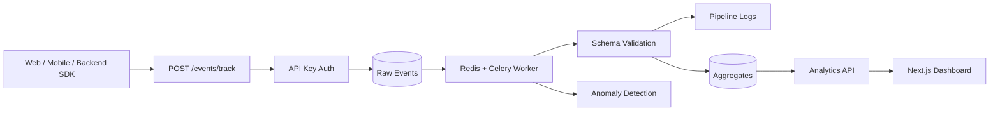

# Event Analytics Pipeline

[](https://github.com/SpyloDEV/event-analytics-pipeline/actions/workflows/ci.yml)


A lead-level event analytics and data pipeline platform for product and engineering teams. It models the core of an internal Segment/Mixpanel-style system: event ingestion, API keys, schema validation, raw event storage, async pipeline jobs, aggregates, funnels, anomaly detection, pipeline logs, audit trails, and dashboards.

This is built like a real internal platform, not a tutorial. The backend uses FastAPI, SQLAlchemy 2.0, Alembic, PostgreSQL, Redis, Celery, service/repository layers, hashed API keys, and tests. The frontend is a polished Next.js dashboard for operators and analysts.

## Architecture



## Features

- JWT auth with register, login, and current user endpoint
- Organizations, projects, project members, and roles: owner, admin, developer, analyst, viewer
- Hashed API keys scoped to projects with revoke and last-used tracking
- API-key protected event ingestion through `/events/track` and `/events/batch`
- Raw event storage with properties, context, timestamp, ingestion status, and validation errors
- Event schema registry with required properties and property type validation
- Pipeline logs for received, validation started, validation passed/failed, aggregation updated, and anomaly detected events
- Aggregation APIs for overview, top events, users, countries, sources, and event trends
- Funnel definitions and conversion result calculation
- Mock anomaly detection for volume spikes, drops, validation error rate, and missing expected events
- Audit logs for project, API key, schema, rejected event, and anomaly actions
- Next.js dashboard with event tables, schemas, funnels, anomalies, pipeline health, analytics, API keys, and audit logs
- Docker Compose and GitHub Actions CI

## Event Ingestion Flow

1. Client sends an event with `X-API-Key`.
2. API key is hashed and matched against active project credentials.
3. Raw event is stored with `accepted` status.
4. Pipeline logs `event received`.
5. Validation loads the event schema if one exists.
6. Missing required fields or invalid property types mark the event as `failed`.
7. Valid events are marked `processed`.
8. Analytics and anomaly views read from stored raw events and pipeline data.

## API Example

```bash
curl -X POST http://localhost:8000/api/v1/events/track \
  -H "Content-Type: application/json" \
  -H "X-API-Key: sk_live_demo_event_pipeline_key" \
  -d '{
    "event_name": "document_uploaded",
    "user_id": "user_123",
    "anonymous_id": "anon_456",
    "timestamp": "2026-05-02T12:00:00Z",
    "properties": {
      "file_type": "pdf",
      "file_size_mb": 2.4,
      "source": "dashboard"
    },
    "context": {
      "ip": "127.0.0.1",
      "user_agent": "browser",
      "country": "DE"
    }
  }'
```

Create a schema:

```json
{
  "project_id": "project_123",
  "event_name": "document_uploaded",
  "required_properties": {
    "file_type": "string",
    "file_size_mb": "number"
  },
  "property_types": {
    "file_type": "string",
    "file_size_mb": "number",
    "source": "string"
  }
}
```

## SDK Examples

Python:

```python
from event_pipeline import EventPipelineClient

client = EventPipelineClient(
    api_url="http://localhost:8000/api/v1",
    api_key="sk_live_demo_event_pipeline_key",
)

client.track(
    "document_uploaded",
    user_id="user_123",
    properties={"file_type": "pdf", "file_size_mb": 2.4},
    context={"country": "DE"},
)
```

JavaScript example: `sdk/javascript/example.ts`.

## Dashboard

Screenshot placeholders:

- `docs/screenshots/dashboard.png`
- `docs/screenshots/events.png`
- `docs/screenshots/pipeline.png`
- `docs/screenshots/funnels.png`

## Local Setup

```bash
cp .env.example .env
cd backend
python -m venv .venv
.venv\Scripts\activate
pip install -e ".[dev]"
alembic upgrade head
uvicorn app.main:app --reload
```

In another terminal:

```bash
cd frontend
npm install
npm run dev
```

Open:

- Frontend: `http://localhost:3000`
- API docs: `http://localhost:8000/docs`

## Docker Setup

```bash
cp .env.example .env
docker compose up --build
```

Services:

- Backend API: `http://localhost:8000`
- Frontend: `http://localhost:3000`
- PostgreSQL: `localhost:5432`
- Redis: `localhost:6379`
- Worker: Celery event queue

## Testing

```bash
make lint
make test
```

Backend-only:

```bash
cd backend
ruff check .
black --check .
pytest
```

Frontend-only:

```bash
cd frontend
npm run lint
npm run typecheck
npm run build
```

## Demo Data

```bash
cd backend
python scripts/seed_demo.py
```

Demo credentials:

- Email: `platform@example.com`
- Password: `SecurePass123!`
- API key: `sk_live_demo_event_pipeline_key`

Seed data includes a demo organization, project, API key, event schemas, raw processed events, a funnel, an anomaly, pipeline logs, and audit logs.

## Folder Structure

```text
backend/
  app/
    api/routes/
    core/
    db/
    models/
    repositories/
    schemas/
    services/
    workers/
  alembic/
  tests/
frontend/
  app/
  components/
  hooks/
  lib/
  types/
sdk/
  python/
  javascript/
```

## Why This Is Lead-Level

This project demonstrates platform and data engineering skills that show up in real product analytics systems: event ingestion contracts, schema validation, raw event preservation, async processing, aggregate-friendly APIs, anomaly detection, funnel analysis, API key security, auditability, CI, Dockerized development, and a dashboard designed for internal operators.
